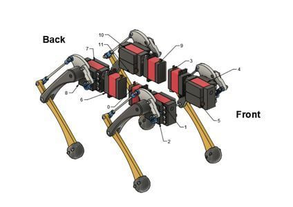
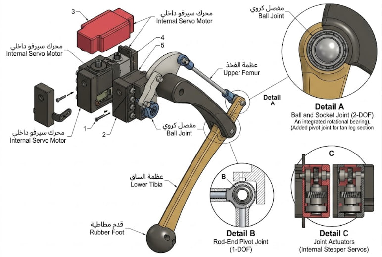
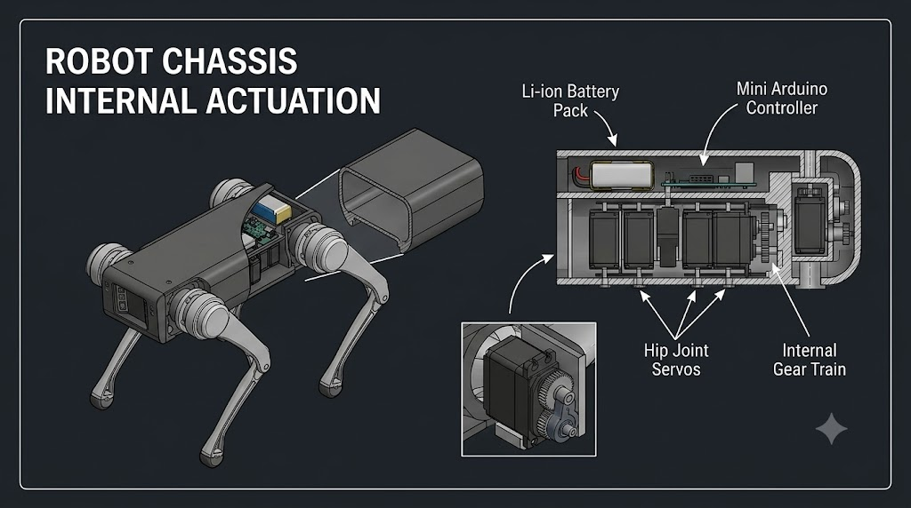
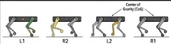

# 🐾 Simple Quadruped Robot Mechanical Design 

An engineering project focused on designing and simulating a simple quadruped robot (robotic dog) that mimics natural animal locomotion, analyzing mechanical stability, load distribution, degrees of freedom, and motor selection.

---

## 📌 Table of Contents
1. [Project Purpose](#-project-purpose)
2. [Robot Tasks](#-robot-tasks)
3. [Mechanical Structure Design](#-mechanical-structure-design)
4. [Degrees of Freedom & Joint Analysis](#-degrees-of-freedom--joint-analysis)
5. [Actuation System & Motor Selection](#-actuation-system--motor-selection)
6. [Mathematical Analysis & Torque Calculation](#-mathematical-analysis--torque-calculation)
7. [Proposed Materials & Manufacturing Methods](#-proposed-materials--manufacturing-methods)
8. [Proposed Gait Analysis](#-proposed-gait-analysis)
9. [Anticipated Mechanical Challenges](#-anticipated-mechanical-challenges)

---

## 🎯 Project Purpose
The primary objective of this project is to design and develop a quadruped robot capable of moving in a manner that simulates canine locomotion while maintaining balance and stability during transit. This project serves as an integrated application combining:
* **Mechanical Design** and load-bearing analysis.
* **Control Systems and Programming** for dynamic balancing.
* **Electronics** for motor synchronization and kinematic analysis to achieve stable, efficient performance.

## ⚙️ Robot Tasks
The quadruped robot is designed to execute several foundational tasks, including:
* [x] **Locomotion & Mobility:** Navigating various terrains while actively maintaining balance.
* [x] **Obstacle Negotiation:** Overcoming simple physical obstacles that obstruct its path.
* [x] **Payload Carriage:** Transporting lightweight equipment or payloads (e.g., cameras, LIDAR, or environmental sensors).

---

## 📐 Mechanical Structure Design

### 1. Body Shape & Main Chassis
The robot utilizes a bio-inspired quadrupedal configuration:
* **Central Chassis:** A rectangular main frame where four limbs are mounted (two at the front, two at the rear).
* **Design Advantages:** This geometry evenly distributes the payload across all four limbs, maximizes static stability, and provides a protected internal cavity to shelter the actuators, microcontrollers, batteries, and sensors.

> 📷 *Initial General Design of the Robot (Front & Back Views):*
> 

### 2. Leg Anatomy
Each mechanical limb consists of three primary components:
1. **Upper Femur:** The proximal segment connected directly to the main chassis.
2. **Lower Tibia:** The distal segment completing the leg structure.
3. **Rubber Foot:** Attached to the bottom of the limb to provide a high coefficient of friction with the ground and absorb impact shocks.

> 📷 *Detailed Leg Anatomy and Internal Joints:*
> 

---

## 🕹️ Degrees of Freedom & Joint Analysis
To ensure stable, realistic, and biomimetic locomotion, each leg is engineered with **2 Degrees of Freedom (2-DOF)**, distributed across the following joints:
* **Hip Joint:** Connects the upper femur to the main chassis, allowing rotational movement relative to the body.
* **Knee Joint:** Responsible for flexing and extending the lower tibia.
* **Ball Joint (Detail A):** Grants freedom of movement in two directional axes (2-DOF) integrated with a rotary bearing.
* **Rod-End Pivot Joint (Detail B):** Provides a single degree of freedom (1-DOF) pivot.

---

## ⚡ Actuation System & Motor Selection
The robot utilizes **Internal Stepper Servos** embedded safely within the main chassis rather than mounted directly on the external limbs.

### Why were these actuators selected?
* High precision control over angular displacement and positioning.
* Stable and sufficient torque output to support leg acceleration and payload.
* Compact form-factor and low weight, minimizing the robot's overall moment of inertia.

### Why are the motors housed inside the chassis?
* To isolate them from direct physical impacts, dust, debris, and external environmental factors.

---

## 📊 Mathematical Analysis & Torque Calculation
To determine the required holding and operating torque at the hip joint during a lifting phase, the fundamental mechanical torque equation is applied:

$$T = F \times L$$

**Simulation & Case Study:**
* Assuming the downward vertical force (load) acting on a single leg ($F$) = $10\text{ N}$
* The perpendicular distance from the joint pivot to the center of the load ($L$) = $0.08\text{ m}$

$$\text{T} = 10\text{ N} \times 0.08\text{ m} = 0.8\text{ N.m}$$

📌 **Engineering Conclusion:** The selected servo motors must be rated for an operating torque **greater than $0.8\text{ N.m}$** to account for a dynamic factor of safety and guarantee operational stability.
> 

---

## 🛠️ Proposed Materials & Manufacturing Methods

| Proposed Material | Anticipated Manufacturing Methods |
| :--- | :--- |
| **Aluminum Alloys** (For load-bearing structural elements under stress) | **3D Printing (Additive Manufacturing)** using PLA, PETG, or ABS |
| **Reinforced Plastics / Polymers** | Mechanical Assembly using **bolts, nuts, and fasteners** |
| **Flexible Rubber / Silicone** (For the feet to maximize traction) | Laser/CNC Cutting for flat chassis sheets |

---

## 🚶 Proposed Gait Analysis
The primary locomotion pattern chosen for this robot is the **Sequence Walk Gait (Gait Walk)**:
* **Locomotion Mechanism:** Only one leg lifts and transitions at a time, while the remaining three legs maintain solid, continuous contact with the ground surface.
* **Justification:**
  1. Ensures the Center of Gravity (CoG) stays safely within the support polygon, providing excellent static stability.
  2. Greatly reduces the probability of tipping or loss of balance during locomotion.
  3. Simplifies programmatic control algorithms and inverse kinematics calculations.
> 
---

## ⚠️ Anticipated Mechanical Challenges
During physical prototyping, calibration, and testing, the following technical challenges must be monitored and resolved:
1. **Dynamic Overloads:** Elevated momentary torque demands on the hip motors during high-acceleration lifting phases.
2. **Slippage:** Potential foot slippage when moving on smooth or polished surfaces (requires optimizing the rubber tread compound).
3. **Mechanical Vibrations:** Oscillations propagated through the chassis during fast transitions between steps.
4. **Center of Mass Shift:** Improper internal layout of heavy components (e.g., batteries) leading to a skewed Center of Gravity (CoG).
